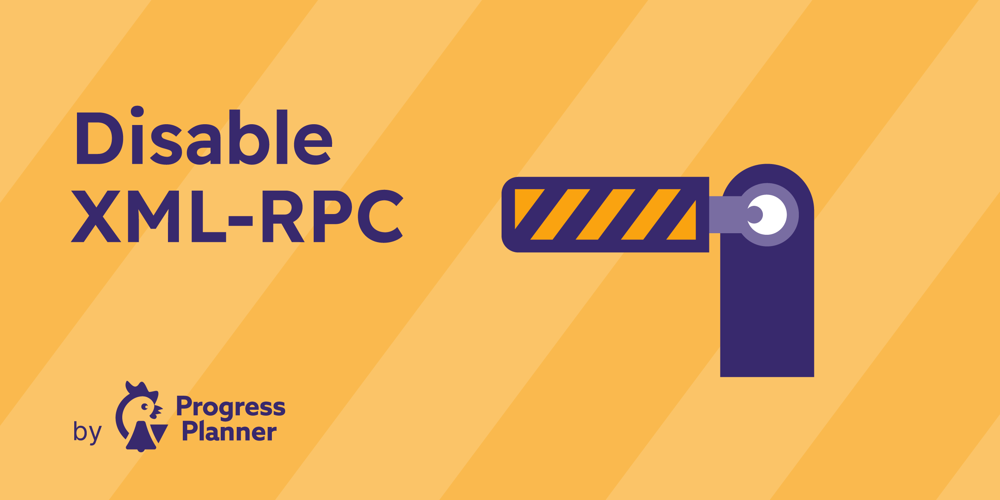

# Disable XML-RPC by Progress Planner

A lightweight WordPress plugin that disables XML-RPC completely, helping reduce attack surface and block unwanted XML-RPC access with zero configuration.

## Why use this plugin?

If your site does not rely on XML-RPC, leaving it enabled serves little purpose and can create unnecessary exposure. This plugin turns XML-RPC off in a minimal, focused way.

### Benefits

- Disables XML-RPC for WordPress sites that do not need it
- Returns a 403 response for XML-RPC requests
- Works immediately after activation
- No settings page, setup wizard, or maintenance overhead
- Tiny codebase with a single, clear purpose

## Who is this for?

This plugin is a good fit for:

- site owners who do not use XML-RPC-based publishing or integrations
- agencies and developers hardening client sites
- WordPress installs where XML-RPC is not part of the workflow

## Important compatibility note

Do **not** use this plugin if your site depends on XML-RPC for publishing or integrations. Disabling XML-RPC can affect tools or services that still rely on it.

## Installation

### From WordPress admin

1. Go to **Plugins → Add New**.
2. Search for **Disable XML-RPC by Progress Planner**.
3. Install and activate the plugin.

### From GitHub or a ZIP file

1. Download this repository as a ZIP.
2. Upload it via **Plugins → Add New → Upload Plugin**.
3. Activate the plugin.

## What happens after activation?

Once activated, the plugin:

- disables WordPress XML-RPC through the relevant filter
- blocks XML-RPC requests directly
- shows a clear “XML-RPC Disabled” response when access is attempted

There are no settings to configure.

## Frequently asked questions

### Does this plugin have a settings page?

No. It is intentionally configuration-free.

### Will this improve security?

It can help reduce exposure on sites that do not need XML-RPC. Like any hardening step, it should be part of a broader security strategy.

### Will this break anything?

It may, if you use a service, app, or workflow that still depends on XML-RPC. Review your stack before activating it on production sites.

## Development

This is a deliberately small utility plugin. If you want to review behavior, start with:

- `pp-disable-xml-rpc.php`

## License

MIT. See [LICENSE](LICENSE).

## Recommended GitHub About settings

These cannot be fully managed from files alone, but they will improve the repository page:

- **Description:** Disable WordPress XML-RPC completely with a lightweight, no-settings plugin.
- **Website:** https://progressplanner.com/
- **Topics:** `wordpress`, `wordpress-plugin`, `xml-rpc`, `security`, `hardening`, `site-security`, `progress-planner`
- **Social preview:** Use `.wordpress.org/banner-1544x500.png` or create a 1280×640 social card based on the existing banner
